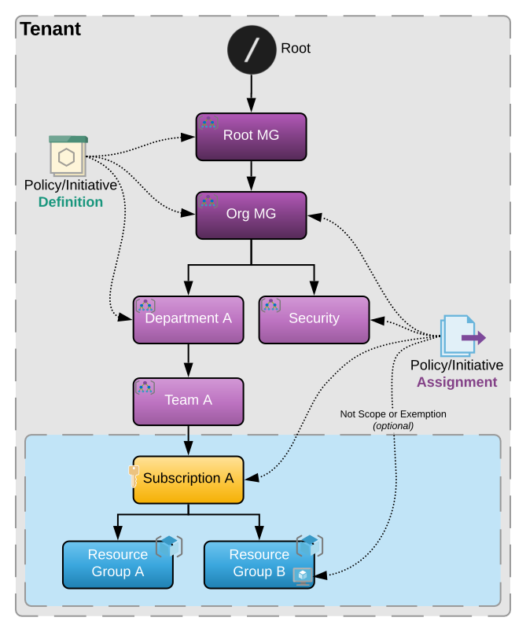

<!-- markdownlint-configure-file { "MD004": { "style": "consistent" } } -->
<!-- markdownlint-disable MD033 -->
<p align="center">
  <a href="https://learn.microsoft.com/en-us/azure/governance/policy/">
      
  </a>
  <br>
  <h1 align="center">Azure Policy as Code with Terraform</h1>
  <p align="center">
    <a href="https://github.com/gettek/terraform-azurerm-policy-as-code/actions/workflows/cd.yml"></a>
    <a href="https://github.com/gettek/terraform-azurerm-policy-as-code/actions/workflows/ci.yml"></a></br>
    <a href="https://github.com/gettek/terraform-azurerm-policy-as-code/discussions"></a>
    <a href="LICENSE"></a></br>
    <a href="https://github.dev/gettek/terraform-azurerm-policy-as-code"></a>
    </br>
    <a href="https://registry.terraform.io/modules/gettek/policy-as-code/azurerm/"></a>
  </p>
</p>
<!-- markdownlint-enable MD033 -->

- [Repo Folder Structure](#repo-folder-structure)
- [Custom Policy Definitions Module](#custom-policy-definitions-module)
- [Policy Initiative (Set Definitions) Module](#policy-initiative-set-definitions-module)
- [Policy Definition Assignment Module](#policy-definition-assignment-module)
- [Policy Initiative Assignment Module](#policy-initiative-assignment-module)
- [Policy Exemption Module](#policy-exemption-module)
- [Achieving Continuous Compliance](#achieving-continuous-compliance)
  - [⚙️Assignment Effects](#️assignment-effects)
  - [👥Role Assignments](#role-assignments)
  - [✅Remediation Tasks](#remediation-tasks)
  - [⏱️On-demand evaluation scan](#️on-demand-evaluation-scan)
  - [🎯Definition and Assignment Scopes](#definition-and-assignment-scopes)
- [📗Useful Resources](#useful-resources)
- [Limitations](#limitations)

## Repo Folder Structure

```bash
📦examples
  ├──📜assignments_mg.tf
  ├──📜backend.tf
  ├──📜built-in.tf
  ├──📜data.tf
  ├──📜definitions.tf
  ├──📜exemptions.tf
  ├──📜initiatives.tf
  ├──📜variables.tf
📦modules
  └──📂def_assignment
      ├──📜main.tf
      ├──📜outputs.tf
      └──📜variables.tf
  └──📂definition
      ├──📜main.tf
      ├──📜outputs.tf
      └──📜variables.tf
  └──📂exemption
      ├──📜main.tf
      ├──📜outputs.tf
      └──📜variables.tf
  └──📂initiative
      ├──📜main.tf
      ├──📜outputs.tf
      └──📜variables.tf
  └──📂set_assignment
      ├──📜main.tf
      ├──📜outputs.tf
      └──📜variables.tf
📦policies
  └──📂policy_category (e.g. General, should correspond to [var.policy_category])
      └──📜policy_name.json (e.g. whitelist_regions, should correspond to [var.policy_name])
📦scripts
  ├──📂dsc_examples
  └──📜build_machine_config_packages.ps1 (build and publish custom guest configuration packages)
```

## [Custom Policy Definitions Module](modules/definition)

This module depends on populating `var.policy_name` and `var.policy_category` to correspond with the respective custom policy definition `json` file found in the [local library](policies). You can also parse in other template files and data sources at runtime, see the [module readme](modules/definition) for examples and acceptable inputs.

```hcl
module whitelist_regions {
  source              = "gettek/policy-as-code/azurerm//modules/definition"
  policy_name         = "whitelist_regions"
  display_name        = "Allow resources only in whitelisted regions"
  policy_category     = "General"
  management_group_id = data.azurerm_management_group.org.id
}
```

> 📘 [Microsoft Docs: Azure Policy definition structure](https://learn.microsoft.com/en-us/azure/governance/policy/concepts/definition-structure)

## [Policy Initiative (Set Definitions) Module](modules/initiative)

Dynamically create a policy set based on multiple custom or built-in policy definition references to simplify assignments.


```hcl
module platform_baseline_initiative {
  source                  = "gettek/policy-as-code/azurerm//modules/initiative"
  initiative_name         = "platform_baseline_initiative"
  initiative_display_name = "[Platform]: Baseline Policy Set"
  initiative_description  = "Collection of policies representing the baseline platform requirements"
  initiative_category     = "General"
  management_group_id     = data.azurerm_management_group.org.id

  member_definitions = [
    module.whitelist_resources.definition,
    module.whitelist_regions.definition
  ]
}
```

> 📘 [Microsoft Docs: Azure Policy initiative definition structure](https://learn.microsoft.com/en-us/azure/governance/policy/concepts/initiative-definition-structure)

## [Policy Definition Assignment Module](modules/def_assignment)

```hcl
module org_mg_whitelist_regions {
  source            = "gettek/policy-as-code/azurerm//modules/def_assignment"
  definition        = module.whitelist_regions.definition
  assignment_scope  = data.azurerm_management_group.org.id
  assignment_effect = "Deny"

  assignment_parameters = {
    listOfRegionsAllowed = [
      "UK South",
      "UK West",
      "Global"
    ]
  }
}
```

> 📘 [Microsoft Docs: Azure Policy assignment structure](https://learn.microsoft.com/en-us/azure/governance/policy/concepts/assignment-structure)

## [Policy Initiative Assignment Module](modules/set_assignment)

```hcl
module org_mg_platform_diagnostics_initiative {
  source                  = "gettek/policy-as-code/azurerm//modules/set_assignment"
  initiative              = module.platform_diagnostics_initiative.initiative
  assignment_scope        = data.azurerm_management_group.org.id
  assignment_effect       = "DeployIfNotExists"

  # optional resource remediation inputs
  re_evaluate_compliance  = false
  skip_remediation        = false
  skip_role_assignment    = false
  remediation_scope       = data.azurerm_subscription.current.id

  assignment_parameters = {
    workspaceId                 = data.azurerm_log_analytics_workspace.workspace.id
    storageAccountId            = data.azurerm_storage_account.sa.id
    eventHubName                = data.azurerm_eventhub_namespace.ehn.name
    eventHubAuthorizationRuleId = data.azurerm_eventhub_namespace_authorization_rule.ehr.id
    metricsEnabled              = "True"
    logsEnabled                 = "True"
  }

  assignment_not_scopes = [
    data.azurerm_management_group.team_a.id
  ]

  non_compliance_messages = {
    null                                      = "The Default non-compliance message for all member definitions"
    DeployApplicationGatewayDiagnosticSetting = "The non-compliance message for the deploy_application_gateway_diagnostic_setting definition"
  }
}
```

## [Policy Exemption Module](modules/exemption)

Use the exemption module in favour of `not_scopes` to create an auditable time-sensitive Policy exemption

```hcl
module exemption_team_a_mg_deny_nic_public_ip {
  source               = "gettek/policy-as-code/azurerm//modules/exemption"
  name                 = "Deny NIC Public IP Exemption"
  display_name         = "Exempted while testing"
  description          = "Allows NIC Public IPs for testing"
  scope                = data.azurerm_management_group.team_a.id
  policy_assignment_id = module.team_a_mg_deny_nic_public_ip.id
  exemption_category   = "Waiver"
  expires_on           = "2023-05-25" # optional

  # optional
  metadata = {
    requested_by  = "Team A"
    approved_by   = "Mr Smith"
    approved_date = "2021-11-30"
    ticket_ref    = "1923"
  }
}
```

> 📘 [Microsoft Docs: Azure Policy exemption structure](https://learn.microsoft.com/en-us/azure/governance/policy/concepts/exemption-structure)

## Achieving Continuous Compliance

### ⚙️Assignment Effects

Azure Policy supports the following types of effect:


> 💡 **Note:** If you're managing tags, it's recommended to use `Modify` instead of `Append` as Modify provides additional operation types and the ability to remediate existing resources. However, Append is recommended if you aren't able to create a managed identity or Modify doesn't yet support the alias for the resource property.

> 📘 [Microsoft Docs: Understand how effects work](https://learn.microsoft.com/en-us/azure/governance/policy/concepts/effects)

### 👥Role Assignments

Role assignments and remediation tasks will be automatically created if the Policy Definition contains a list of [Role Definitions](policies/Tags/inherit_resource_group_tags_modify.json#L46). You can override these with explicit ones, [as seen here](examples/assignments_org.tf#L40), or specify `skip_role_assignment=true` to omit creation, this is also skipped when using User Managed Identities. By default role assignment scopes will match the policy assignment but can be changed by setting `role_assignment_scope`.

### ✅Remediation Tasks

Unless you specify `skip_remediation=true`, the `*_assignment` modules will automatically create [remediation tasks](https://learn.microsoft.com/en-us/azure/governance/policy/how-to/remediate-resources) for policies containing effects of `DeployIfNotExists` and `Modify`. The task name is suffixed with a `timestamp()` to ensure a new one gets created on each `terraform apply`.

### ⏱️On-demand evaluation scan

To trigger an on-demand [compliance scan](https://learn.microsoft.com/en-us/azure/governance/policy/how-to/get-compliance-data) with terraform, set `re_evaluate_compliance = true` on `*_assignment` modules, defaults to `false (ExistingNonCompliant)`.

> 💡 **Note:** `ReEvaluateCompliance` only applies to remediation at Subscription scope and below and will take longer depending on the size of your environment.

### 🎯Definition and Assignment Scopes

  - Should be Defined as **high up** in the hierarchy as possible.
  - Should be Assigned as **low down** in the hierarchy as possible.
  - Multiple scopes can be exempt from policy inheritance by specifying `assignment_not_scopes` or using the [exemption module](modules/exemption).
  - Policy **overrides RBAC** so even resource owners and contributors fall under compliance enforcements assigned at a higher scope (unless the policy is assigned at the ownership scope).



> ⚠️ **Requirement:** Ensure the deployment account has at least [Resource Policy Contributor](https://learn.microsoft.com/en-us/azure/role-based-access-control/built-in-roles#resource-policy-contributor) role at the `definition_scope` and `assignment_scope`. To successfully create Role-assignments (or group memberships) the same account may also require the [User Access Administrator](https://learn.microsoft.com/en-us/azure/role-based-access-control/built-in-roles#user-access-administrator) role at the `assignment_scope` or preferably the `definition_scope` to simplify workflows.

## 📗Useful Resources

- [GitHub Repo: Azure Built-In Policies and Samples](https://github.com/Azure/azure-policy)
- [GitHub Repo: Contribute to Community Policies](https://github.com/Azure/Community-Policy)
- [GitHub Repo: AWESOME-Azure-Policy - a collection of awesome references](https://github.com/globalbao/awesome-azure-policy)
- [Microsoft Docs: Azure Policy Home](https://learn.microsoft.com/en-us/azure/governance/policy/)
- [Microsoft Docs: List of Builtin Policies](https://learn.microsoft.com/en-us/azure/governance/policy/samples/built-in-policies)
- [Microsoft Docs: Index of Azure Policy Samples](https://learn.microsoft.com/en-us/azure/governance/policy/samples/)
- [Microsoft Docs: Design Azure Policy as Code workflows](https://learn.microsoft.com/en-us/azure/governance/policy/concepts/policy-as-code)
- [Microsoft Docs: Evaluate the impact of a new Azure Policy definition](https://learn.microsoft.com/en-us/azure/governance/policy/concepts/evaluate-impact)
- [Microsoft Docs: Author policies for array properties on Azure resources](https://learn.microsoft.com/en-us/azure/governance/policy/how-to/author-policies-for-arrays)
- [Microsoft Docs: Azure Policy Regulatory Compliance (Benchmarks)](https://learn.microsoft.com/en-us/azure/azure-resource-manager/management/security-controls-policy)
- [Microsoft Docs: Azure Policy Exemption](https://learn.microsoft.com/en-us/azure/governance/policy/concepts/exemption-structure)
- [Microsoft Tutorial: Build policies to enforce compliance](https://learn.microsoft.com/en-us/azure/governance/policy/tutorials/create-and-manage)
- [Microsoft Tutorial: Security Center - Working with security policies](https://learn.microsoft.com/en-us/azure/security-center/tutorial-security-policy)
- [VSCode Marketplace: Azure Policy Extension](https://marketplace.visualstudio.com/items?itemName=AzurePolicy.azurepolicyextension)
- [AzAdvertizer: Release and change tracking on Azure Governance capabilities](https://www.azadvertizer.net/index.html)
- [Azure Citadel: Creating Custom Policies](https://www.azurecitadel.com/policy/custom/)
- [Terraform Provider: azurerm_policy_definition](https://registry.terraform.io/providers/hashicorp/azurerm/latest/docs/resources/policy_definition)
- [Terraform Provider: azurerm_policy_set_definition](https://registry.terraform.io/providers/hashicorp/azurerm/latest/docs/resources/policy_set_definition)
- [Terraform Provider: multiple assignment resources: azurerm_*_policy_assignment](https://registry.terraform.io/providers/hashicorp/azurerm/latest/docs/resources/management_group_policy_assignment)
- [Terraform Provider: multiple remediation resources: azurerm_*_policy_remediation](https://registry.terraform.io/providers/hashicorp/azurerm/latest/docs/resources/management_group_policy_remediation)
- [Terraform Provider: multiple exemption resources: azurerm_*_policy_exemption](https://registry.terraform.io/providers/hashicorp/azurerm/latest/docs/resources/management_group_policy_exemption)

## Limitations

- `DefinitionName` and `InitiativeName` have a maximum length of **64** characters
- `AssignmentName` has maximum length of **24** characters at Management Group Scope and **64** characters at all other Scopes
- `DisplayName` has a maximum length of **128** characters and `description` a maximum length of **512** characters
- There's a [maximum count](https://learn.microsoft.com/en-us/azure/azure-resource-manager/management/azure-subscription-service-limits#azure-policy-limits) for each object type for Azure Policy. For definitions, an entry of Scope means the management group or subscription. For assignments and exemptions, an entry of Scope means the management group, subscription, resource group, or individual resource:

| Where                                                     | What                             | Maximum count |
|-----------------------------------------------------------|----------------------------------|---------------|
| Scope                                                     | Policy definitions               | 500           |
| Scope                                                     | Initiative definitions           | 200           |
| Tenant                                                    | Initiative definitions           | 2,500         |
| Scope                                                     | Policy or initiative assignments | 200           |
| Scope                                                     | Exemptions                       | 1,000         |
| Policy definition                                         | Parameters                       | 20            |
| Initiative definition                                     | Policies                         | 1,000         |
| Initiative definition                                     | Parameters                       | 300           |
| Policy or initiative assignments                          | Exclusions (notScopes)           | 400           |
| Policy rule                                               | Nested conditionals              | 512           |
| Remediation task                                          | Resources                        | 50,000        |
| Policy definition, initiative, or assignment request body | Bytes                            | 1,048,576     |

Policy rules have additional limits to the number of conditions and their complexity. See [Policy rule limits](https://github.com/MicrosoftDocs/azure-docs/blob/main/articles/governance/policy/concepts/definition-structure.md#policy-rule-limits) for more details.

